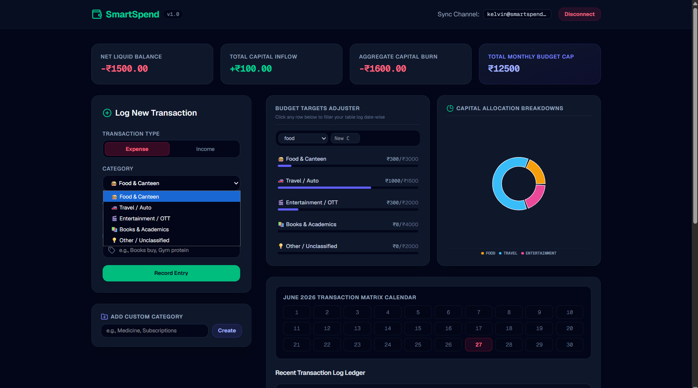
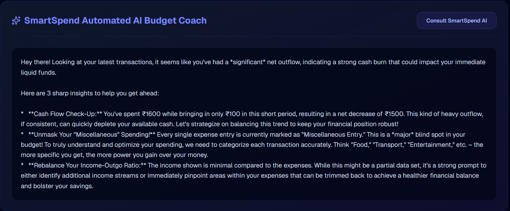
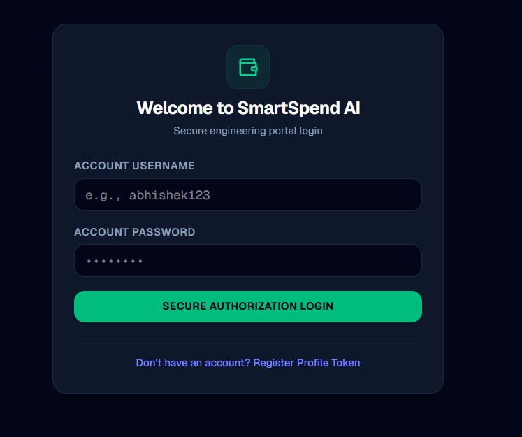
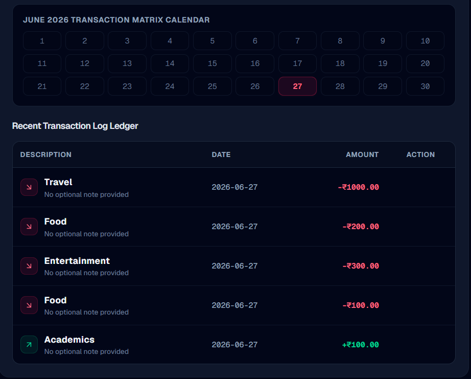

# SmartSpend AI

> AI-powered personal finance tracker built with Next.js, PostgreSQL, Supabase, and Google Gemini to help users manage expenses and receive personalized budgeting insights.

🌐🌐 **Live Demo:** https://smart-spend-ai-nine.vercel.app/


**Key Skills:** Full-Stack Software Engineering • Database Schema Design • Multi-Tenant Architecture • Cryptographic Security • Generative AI Orchestration • Serverless API Design • Data Isolation

---


## Table of Contents

* [Overview](#overview)
* [Why I Built This](#why-i-built-this)
* [Application Preview](#-application-preview)
* [Features](#features)
* [Tech Stack](#tech-stack)
* [Project Highlights](#project-highlights)
* [System Architecture & Data Flow](#️-system-architecture--data-flow)
* [Database Schema Design](#-database-schema-design)
* [Security & Cryptographic Implementation](#-security--cryptographic-implementation)
* [Automated AI Budget Coach Orchestration](#-automated-ai-budget-coach-orchestration)
* [Repository Structure](#-repository-structure)
* [Engineering Challenges & Resolving Technical Debt](#-engineering-challenges--resolving-technical-debt)
* [Future Enhancements](#-future-enhancements)
* [Running Locally](#-running-locally)
* [Acknowledgements](#acknowledgements)

---

## Overview

SmartSpend AI is a full-stack personal finance application that enables users to securely manage income and expenses while receiving AI-generated budgeting recommendations based on their financial history.

The application is built with **Next.js**, **Supabase PostgreSQL**, **Tailwind CSS**, and **Google Gemini**, combining a modern React frontend with a serverless backend and cloud database. It implements custom authentication using **bcrypt** password hashing, isolates each user's financial records through tenant-aware database queries, and exposes REST-style API routes for transaction management and AI analysis.

Beyond providing expense tracking, the project demonstrates practical software engineering concepts including secure authentication, relational database design, multi-user data isolation, serverless API development, and integration of large language models into production-style web applications.


---

## Why I Built This

Most budgeting applications either focus solely on expense tracking or simply wrap an AI chatbot around financial data.

This project was built to explore how modern full-stack web development, secure authentication, relational databases, and generative AI can be combined into a production-style application where every user has isolated financial data and receives personalized budgeting recommendations generated directly from their transaction history.
---


## 📷 Application Preview

| Dashboard | AI Budget Coach |
|------------|-----------------|
|  |  |

| Login | Transactions |
|-------|--------------|
|  |  |


## Features

- 🔐 Custom authentication with bcrypt password hashing
- 👤 Secure multi-user data isolation using Supabase
- 💰 Income and expense tracking with CRUD operations
- 📊 Interactive dashboard with spending analytics and charts
- 🤖 AI-powered budgeting recommendations using Google Gemini
- 📱 Responsive interface built with Next.js and Tailwind CSS
- ☁️ Cloud-hosted PostgreSQL database
- 🚀 Serverless backend using Next.js API Routes
---
## Tech Stack

| Category | Technologies |
|----------|--------------|
| Frontend | Next.js, React, Tailwind CSS |
| Backend | Next.js API Routes |
| Database | PostgreSQL (Supabase) |
| Authentication | Custom Authentication, bcryptjs |
| AI | Google Gemini API |
| Charts | Recharts |
| Deployment | Vercel | 
---

## Project Highlights

- Built a complete full-stack application using Next.js App Router
- Designed a multi-tenant PostgreSQL database with secure user isolation
- Implemented custom authentication using bcrypt password hashing
- Developed REST-style API routes for transaction CRUD operations
- Integrated Google Gemini for AI-powered budgeting advice
- Visualized financial data using interactive charts and analytics
- Deployed the application on Vercel with Supabase as the backend

---

## ⚙️ System Architecture & Data Flow
The platform is built on a decoupled, highly responsive full-stack model optimized for deployment on serverless edge networks:
                    ┌──────────────────────┐
                    │     React Client     │
                    │      (Next.js)       │
                    └──────────┬───────────┘
                               │
                      HTTPS Requests
                               │
                    ┌──────────▼───────────┐
                    │   Next.js API Routes │
                    └──────┬─────────┬─────┘
                           │         │
                Database   │         │ AI Analysis
                           │         │
                 ┌─────────▼──┐   ┌──▼────────────┐
                 │ PostgreSQL │   │ Gemini 2.5    │
                 │ (Supabase) │   │ Google AI API │
                 └────────────┘   └───────────────┘
└─► [AI Intelligence: Google Gen AI SDK Engine via Gemini 2.5]


1. **The Client Tier:** An asynchronous React single-page application built using Next.js client-side states, styled with Tailwind CSS, and using Lucide icons for UI instrumentation. Data distribution arrays are managed locally and mapped seamlessly onto dynamic vectors using Recharts.
2. **The Serverless Backend Tier:** Handles state transmission, input validation, and secure execution loops through Next.js App Router API directory routes.
3. **The Infrastructure Storage Tier:** A high-availability cloud PostgreSQL relational database instance communicating over a secured client channel wrapper.

---

## 🧩 Database Schema Design
The application structures relational records across two main core tables inside PostgreSQL to manage accounting flows with tight storage efficiency:

### 1. `users_credential`
Tracks core access management fields. Passwords are protected via one-way cryptographic transformations.
| Column Name | Data Type | Constraints | Purpose |
| :--- | :--- | :--- | :--- |
| `username` | `TEXT` | `PRIMARY KEY`, `UNIQUE` | Unique user identity token identifier |
| `password` | `TEXT` | `NOT NULL` | One-way cryptographic hash value |

### 2. `transactions`
Maintains financial records mapping dynamically back to the user identity handle.
| Column Name | Data Type | Constraints | Purpose |
| :--- | :--- | :--- | :--- |
| `id` | `UUID` / `TEXT` | `PRIMARY KEY` | Unique transaction trace key |
| `user_id` | `TEXT` | `NOT NULL` | Multi-tenant isolation reference key |
| `type` | `TEXT` | `NOT NULL` | Distinguishes `income` vs `expense` states |
| `category` | `TEXT` | `NOT NULL` | Structural classification string |
| `amount` | `NUMERIC` | `NOT NULL` | Precision value mapping ledger amounts |
| `description` | `TEXT` | `DEFAULT 'Misc'` | User-defined context notes |
| `transaction_date`| `DATE` | `NOT NULL` | Core calendar index index tracking |

---

## 🔒 Security & Cryptographic Implementation
To move the platform from an open prototype to a secure, production-ready environment, a comprehensive defense-in-depth framework was integrated into the identity architecture:

- **Password Cryptography Engine:** Plaintext strings are blocked from entering the database layer. The platform implements `bcryptjs` execution routines, applying a computing cost factor of **10 salt rounds** to dynamically generate cryptographically unique hashes. This completely safeguards user profiles against dictionary and pre-computed rainbow-table hacking vectors.
- **Strict Query Scoping:** All operations targeting database rows are wrapped inside precise PostgreSQL filter hooks. By running explicit `.eq('user_id', targetUserId)` clauses on every single database call, data access boundaries are securely locked down at the database request level.

---

## 🧠 Automated AI Budget Coach Orchestration
The **SmartSpend AI Budget Coach** bypasses standard chatbot configurations by utilizing a contextual data injection pipeline. Rather than expecting users to type out financial summaries manually, the platform automates data synthesis:

1. **State Aggregation:** Upon an execution click, the application isolates the user's specific backend ledger profile, completely stripping out identifiers belonging to foreign database records.
2. **Data Compression & Token Optimization:** The raw row arrays are parsed, cleansed of database metadata bloat, and reassembled into a dense, newline-separated markdown matrix tracking date, type, amount, and description string attributes.
3. **Prompt Boundary Engineering:** The compressed string matrix is injected into a protected instructions layout bound to strict execution rules. The configuration forces the engine to behave as a dedicated financial planner, deliver exactly 3 high-impact behavioral spending critique points, and format responses in clean markdown without leaking internal query variables.
4. **Execution Model:** The payload is processed using Google's high-speed **`gemini-2.5-flash`** model through the official low-latency SDK, streaming strategic budgeting insights back to the client interface within milliseconds.

---

## 📁 Repository Structure

```text
.
├── src/
│   ├── app/
│   │   ├── api/
│   │   │   ├── ai-analyze/
│   │   │   ├── auth/
│   │   │   └── transactions/
│   │   ├── components/
│   │   ├── dashboard/
│   │   └── page.tsx
│   ├── utils/
│   └── lib/
├── public/
├── package.json
└── README.md
└── tailwind.config.js
```


💡## 💡 Engineering Challenges & Resolving Technical Debt

Developing this application involved tackling critical backend and data design architectural bugs:

### 1. Eliminating Multi-Tenant Data Leaks
- **The Problem:** The initial implementation of the AI Budget Coach compiled financial analysis summaries pulling from every single record present within the global database table, exposing private transaction entries across distinct client accounts.
- **The Solution:** Restructured the API endpoint configuration from an unverified open query architecture into a hardened `POST` request routine. Implemented frontend string interpolation logic to securely pull the verified session token object identifier, passing it directly to backend database filter layers to ensure absolute multi-client data sandbox isolation.

### 2. Resolving Strict Data Type Constraints in PostgreSQL
- **The Problem:** Upgrading the application identity framework from native UUID generation systems to custom runtime string handles caused database collision failures. PostgreSQL rejected queries with an `invalid input syntax for type uuid` error due to mismatch criteria on the `user_id` column.
- **The Solution:** Executed a system schema migration utilizing targeted SQL alter data scripts to dynamically re-type the column constraints from standard 36-character `UUID` allocations to a flexible, high-performance `TEXT` schema layout, resolving transaction parsing failures instantly.

---

## 🚀 Future Enhancements

- **Granular Custom Alerts:** Implementing background webhook monitors to trigger threshold alerts when spending tracking nears targeted budget caps.
- **Automated Recurring Ledger Rows:** Engineering automated data cron-jobs to manage monthly student subscription allocations cleanly.
- **OAuth Integration:** Expanding the security stack to support multi-factor single sign-on protocols alongside the custom credentials hashing pipeline.

---


---

## 🚀 Running Locally

Clone the repository:

```bash
git clone https://github.com/TagalpallewarAbhishek/SmartSpend-AI.git
cd SmartSpend-AI
```

Install the dependencies:

```bash
npm install
```

Create a `.env.local` file in the project root and add your environment variables:

```env
NEXT_PUBLIC_SUPABASE_URL=your_supabase_url
NEXT_PUBLIC_SUPABASE_ANON_KEY=your_supabase_anon_key
GEMINI_API_KEY=your_google_ai_api_key
```

Start the development server:

```bash
npm run dev
```

Open **http://localhost:3000** in your browser.

---

## Acknowledgements

Developed independently to analyze multi-tenant full-stack design patterns, secure database token architectures, and serverless edge computation frameworks utilizing the Next.js ecosystem.

---
**Developer:** Abhishek Tagalpallewar  
**Institution:** Indian Institute of Technology Gandhinagar (IITGN)